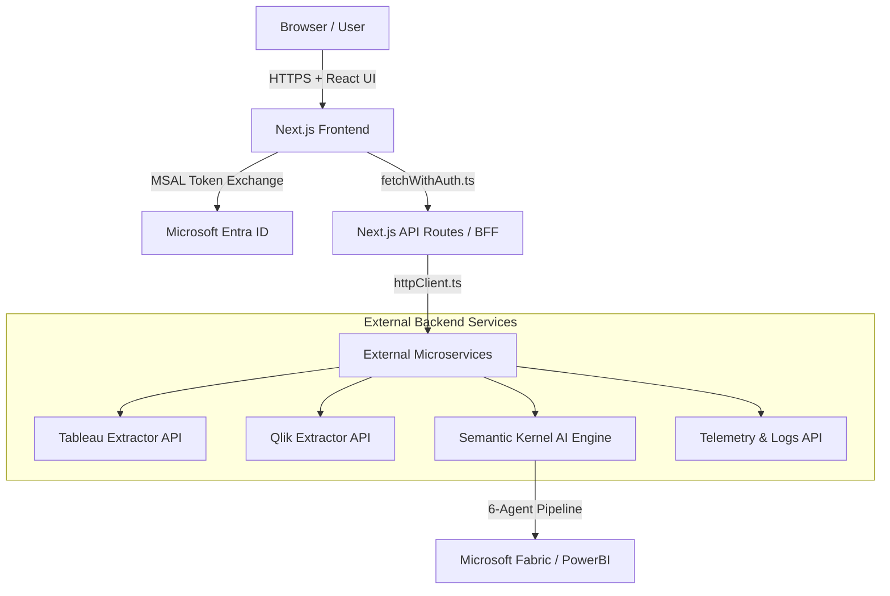

# Architecture

## High-Level Architecture Flow

## Component Breakdown

### 1. Browser / Client Application
- **Location:** `app/(protected)/dashboard`, `components/ui/`, `components/tabs/`
- **Technology:** React 19, Microsoft Fluent UI v9
- **Responsibility:** Rendering the interactive UI, capturing user configuration, and displaying real-time telemetry logs.
- **Inputs:** User clicks, form data, Microsoft Entra ID tokens.
- **Outputs:** HTTP requests to Next.js APIs.

### 2. Next.js API Routes (Backend-for-Frontend)
- **Location:** `app/api/*`
- **Technology:** Next.js 15 Server-Side routes (Node.js)
- **Responsibility:** Protecting the external microservices by ensuring valid MSAL Bearer tokens are present. Sanitizing and routing payloads to the correct internal Python backend.
- **Dependencies:** `lib/api/httpClient.ts`, `lib/fetchWithAuth.ts`
- **Inputs:** Incoming client REST calls with `Authorization: Bearer <token>`.
- **Outputs:** Proxied REST calls to Semantic Kernel, Logs, Tableau, and Qlik microservices.

### 3. State Management Layer
- **Location:** `stores/*`
- **Technology:** Zustand
- **Responsibility:** Centralizing the state of the active migration, polling telemetry, and managing the UI transition between stages (Assessment -> Validation).
- **Communication:** Triggered by component hooks, executes API calls via `fetchWithAuth`.

> [!WARNING]
> **Missing from Repository:** The actual backend logic (Semantic Kernel AI Engine, Microsoft Fabric interactions, Tableau/Qlik extraction engines) is **not** present in this repository. This repository represents strictly the Frontend and the BFF proxy.
