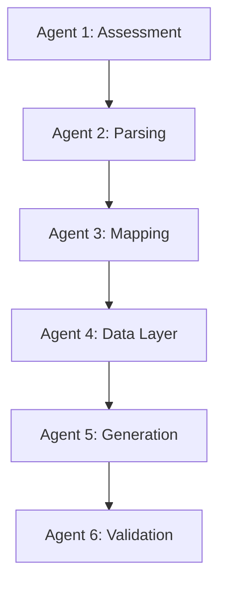

# The 6 AI Agents

> [!WARNING]
> **Implementation Missing:** The source code, prompts, LLM parameters, and Python classes for the AI Agents are **not** in this repository.

However, based on the massive React component `components/tabs/ParsingTab.tsx` and the `agent.store.ts`, we can map exactly what the UI expects from these agents.

## Sequential Execution Flow
The `agent.store.ts` actively tracks the completion of these agents in a strict sequence:



## How the Frontend Tracks Them
The `agent.store.ts` maintains boolean flags for every agent:
```typescript
  assessmentActivitiesDone: Record<string, boolean>
  parsingActivitiesDone: Record<string, boolean>
  datalayerActivitiesDone: Record<string, boolean>
  mappingActivitiesDone: Record<string, boolean>
  generationActivitiesDone: Record<string, boolean>
  validationActivitiesDone: Record<string, boolean>
```

When the polling service detects a log event indicating `status: 'completed'` for a specific agent name, it toggles these booleans, which unlocks the next tab in the UI.
